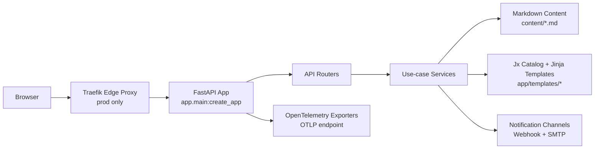
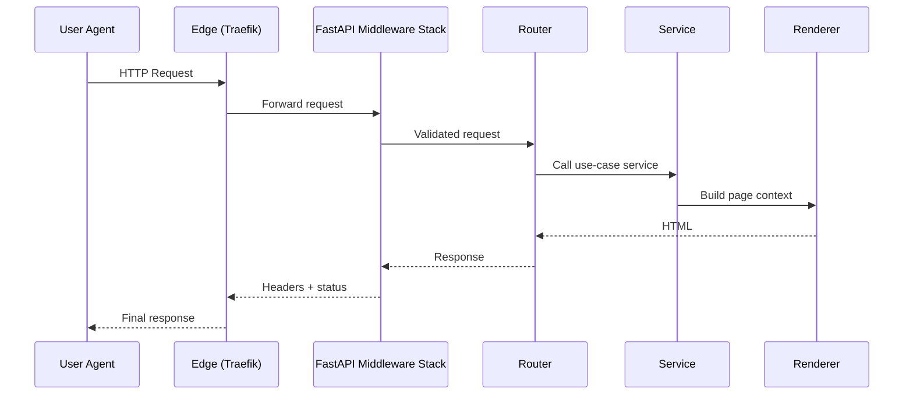
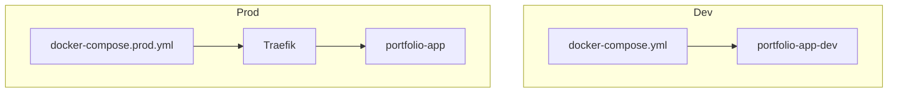
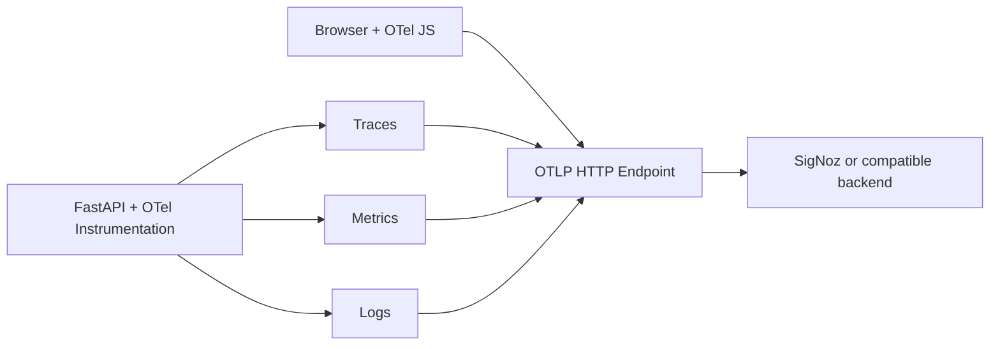

# Architecture

## System Goal

The system is a server-side rendered portfolio application with:

- FastAPI as web backend
- Jx/Jinja components for SSR pages with htmx progressive enhancement
- Alpine.js (reactive state), Stimulus (controllers), htmx (fragment swaps)
- Markdown + frontmatter as content source
- Contact workflow with validation and notifications
- OpenTelemetry integration for backend telemetry and browser traces

## High-Level Architecture

## Runtime Components

### Application Layer

- App factory in `app/main.py` wires middleware, routes, static files, and telemetry.
- Routers in `app/api/*` stay thin and delegate to services.
- Complex flows use orchestrator services (e.g. `ContactOrchestrator`).
- Page rendering uses typed context models and `render_page`.
- All custom middleware uses pure ASGI protocol (no `BaseHTTPMiddleware`).

### Domain and Content

- Domain models and schemas are in `app/models/*`.
- Content is file-based (`content/about.md`, `content/projects/*.md`,
  and `content/blog/*.md`).
- Markdown is parsed, sanitized with nh3, and transformed into structured data.
- Content is cached with a configurable TTL (`MARKDOWN_CACHE_TTL`, default 300s).

### Rendering Layer

- Jx `Catalog` is built in `app/core/dependencies.py`.
- Components are organized in `app/templates/{layouts,pages,features,ui}`.
- Templates are rendered with explicit context contracts (`PageRenderData`).
- `render_fragment()` in `app/core/rendering.py` supports htmx partial
  responses — routes detect `HX-Request` header and return fragments instead
  of full pages for progressive enhancement.

### Integrations

- Contact notifications: webhook (HTTPX) and SMTP channels.
- Telemetry export: OTLP (traces/metrics/logs) with optional console exporter.
- Runtime supports two observability bootstraps:
  - app-managed setup via `configure_telemetry()`
  - auto-instrumented setup via `opentelemetry-instrument`, with provider reuse
    to avoid double instrumentation; this path expects `OTEL_*` to already be
    exported in the process environment

## Request Lifecycle (Conceptual)

## Main Route Map

| Method | Path                      | Purpose             |
| ------ | ------------------------- | ------------------- |
| `GET`  | `/`                       | Home page           |
| `GET`  | `/about`                  | About page          |
| `GET`  | `/projects`               | Projects list       |
| `GET`  | `/projects/{slug}`        | Project detail      |
| `GET`  | `/blog`                   | Blog home           |
| `GET`  | `/blog/posts`             | Blog posts list     |
| `GET`  | `/blog/posts/{slug}`      | Blog post detail    |
| `GET`  | `/blog/tags`              | Blog tags           |
| `GET`  | `/blog/tags/{tag}`        | Blog tag detail     |
| `GET`  | `/blog/feed.xml`          | RSS feed            |
| `GET`  | `/contact`                | Contact form page   |
| `POST` | `/contact`                | Contact submission  |
| `POST` | `/otel/v1/traces`         | Frontend OTLP proxy |
| `GET`  | `/health`                 | Health check        |

## Deployment Topology

## Observability Architecture

