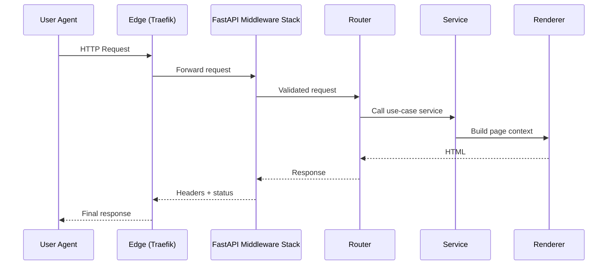
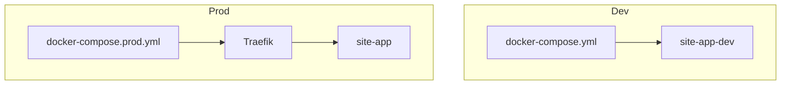
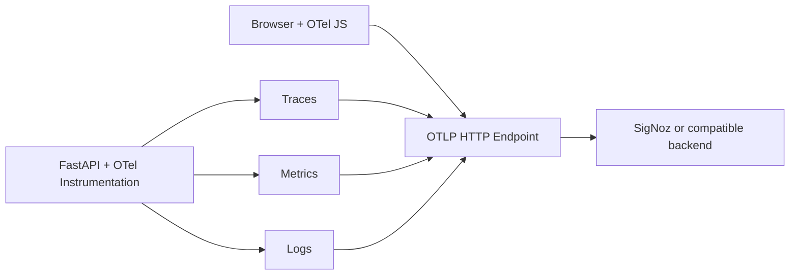

# Architecture

## System Goal

The system is a server-side rendered personal site with:

- FastAPI as web backend
- Jx/Jinja components for SSR pages with htmx progressive enhancement
- Alpine.js (reactive state), Stimulus (controllers), htmx (fragment swaps)
- Markdown + frontmatter as content source
- Contact workflow with validation and notifications
- OpenTelemetry integration for backend telemetry and browser traces

## High-Level Architecture

```mermaid
flowchart LR
    B[Browser] --> T[Traefik Edge Proxy\nprod only]
    T --> A[FastAPI App\napp.main:create_app]
    A --> V[View Routes\napp/views/*]
    A --> API[API Routes\napp/api/*]
    V --> S[Use-case Services]
    S --> I18n[i18n Translations\ncontent/i18n/*.yaml]
    S --> C[Markdown Content\ncontent/{lang}/*.md]
    S --> J[Jx Catalog + Jinja Templates\napp/templates/*]
    S --> N[Notification Channels\nWebhook + SMTP]
    A --> O[OpenTelemetry Exporters\nOTLP endpoint]
```

## Runtime Components

### Application Layer

- App factory in `app/main.py` wires middleware, routes, and static files.
- Frontend view routes in `app/views/*` serve SSR HTML pages and delegate to services.
- Infrastructure API routes in `app/api/*` handle JSON endpoints (health)
  and proxies (telemetry).
- Complex flows use orchestrator services (e.g. `ContactOrchestrator`).
- Page rendering uses typed context models and `render_page`.
- All custom middleware uses pure ASGI protocol (no `BaseHTTPMiddleware`).

### Domain and Content

- Domain models are split per-domain in `app/models/*` (`about.py`, `blog.py`,
  `project.py`, `contact.py`, `seo.py`).
- Content is file-based and language-aware: `content/{lang}/about.md`,
  `content/{lang}/projects/*.md`, and `content/{lang}/blog/*.md`.
- UI strings are externalized in `content/i18n/{lang}.yaml` (en, pt-br).
- Markdown is rendered with mistune, sanitized with nh3, and cached with
  a configurable TTL (`MARKDOWN_CACHE_TTL`, default 300s).
- `content/{lang}/about.md` uses YAML frontmatter for structured resume data
  (work experience, education, certificates, skills) and markdown body for
  hero/about prose sections.

### Rendering Layer

- Jx `Catalog` is built in `app/core/dependencies.py`.
- Components are organized in `app/templates/{layouts,pages,features,ui}`.
- Templates are rendered with explicit context contracts (`PageRenderData`).
- Translation object `t` is injected as a Jx render-time global so all child
  components can access i18n strings without explicit prop drilling.
- `render_fragment()` in `app/core/rendering.py` supports htmx partial
  responses — routes detect `HX-Request` header and return fragments instead
  of full pages for progressive enhancement.

### i18n

- `app/core/i18n.py` loads and caches YAML translation files per language.
- `app/core/language.py` provides `LanguageMiddleware` that sets
  `request.state.lang` from URL prefix or `Accept-Language` header.
- Translations are validated via Pydantic models at load time.
- Templates use `t.*` notation (e.g., `t.pages.blog.title`, `t.cta.view_all_projects`).

### Integrations

- Contact notifications: webhook (HTTPX) and SMTP channels.
- Telemetry export: OTLP (traces/metrics/logs) via `opentelemetry-instrument`.
- Browser traces are proxied through `POST /otel/v1/traces` before reaching the
  collector.

## Request Lifecycle (Conceptual)

```mermaid
sequenceDiagram
    participant U as User Agent
    participant E as Edge (Traefik)
    participant M as FastAPI Middleware Stack
    participant Rt as Router
    participant Sv as Service
    participant Re as Renderer

    U->>E: HTTP Request
    E->>M: Forward request
    M->>Rt: Validated request
    Rt->>Sv: Call use-case service
    Sv->>Re: Build page context
    Re-->>Rt: HTML
    Rt-->>M: Response
    M-->>E: Headers + status
    E-->>U: Final response
```

## Main Route Map

| Method | Path                      | Purpose             |
| ------ | ------------------------- | ------------------- |
| `GET`  | `/`                       | Home page           |
| `GET`  | `/about`                  | About page          |
| `GET`  | `/projects`               | Projects list       |
| `GET`  | `/projects/{slug}`        | Project detail      |
| `GET`  | `/blog`                   | Blog home           |
| `GET`  | `/blog/posts`             | Blog posts list     |
| `GET`  | `/blog/posts/{slug}`      | Blog post detail    |
| `GET`  | `/blog/tags`              | Blog tags           |
| `GET`  | `/blog/tags/{tag}`        | Blog tag detail     |
| `GET`  | `/blog/feed.xml`          | RSS feed            |
| `GET`  | `/contact`                | Contact form page   |
| `POST` | `/contact`                | Contact submission  |
| `POST` | `/otel/v1/traces`         | Frontend OTLP proxy |
| `GET`  | `/health`                 | Health check        |

## Deployment Topology

```mermaid
flowchart TB
    subgraph Dev
        D1[docker-compose.yml]
        D2[site-app-dev]
        D1 --> D2
    end

    subgraph Prod
        P1[docker-compose.prod.yml]
        P2[Traefik]
        P3[site-app]
        P1 --> P2 --> P3
    end
```

## Observability Architecture

```mermaid
flowchart LR
    Browser[Browser + OTel JS] --> OTLP[OTLP HTTP Endpoint]
    App[FastAPI + OTel Instrumentation] --> Tr[Traces]
    App --> Me[Metrics]
    App --> Lo[Logs]
    Tr --> OTLP
    Me --> OTLP
    Lo --> OTLP
    OTLP --> SigNoz[SigNoz or compatible backend]
```
